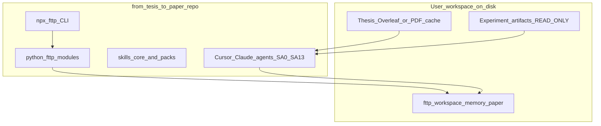
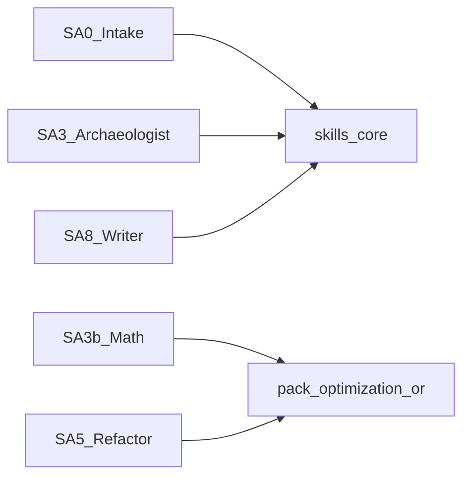
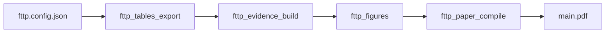

# from-thesis-to-paper — Master implementation plan

> **SUPERSEDES:** [paperepn_agent_orchestration_915feb8e.plan.md](paperepn_agent_orchestration_915feb8e.plan.md) (PaperEPN-internal).  
> **Target:** NEW git repository `from-thesis-to-paper` — **not** inside `mi-investigacion-opt`.  
> **Audience of this plan:** a **less capable executor model** — follow micro-steps literally; do not skip verification gates.

---

## 0. Executor contract (read first)

1. **Language:** all NEW repo files in **English** unless marked `i18n/user-chat`.
2. **User chat:** agents may interact in **Spanish or English** (bilingual rule).
3. **One micro-step = one commit** (recommended) with message `fttp: <step-id> <short description>`.
4. After each step, run the **Verify** command; if it fails, stop and report `TAREA INCOMPLETA` — do not continue.
5. **Do not** copy 57GB verification trees into the new repo. **Do not** depend on PaperEPN paths except in `examples/`.
6. If a step says **ASK USER**, use AskQuestion or wait for explicit answer before proceeding.
7. **Domain pack:** optimization-or is **optional**; core agents must work without Gurobi installed.

---

## 1. Product vision and niche (critical)

### What it is

**from-thesis-to-paper** (`fttp`) is a **portfolio-grade framework** that agentifies:

`thesis (ground truth) → evidence audit → narrative contract → LaTeX paper → optional peer review → optional public release`

### Niche — honest assessment

| Layer | Who it serves | Generic? |
|-------|---------------|------------|
| **Core** | STEM theses with experiments + LaTeX + tabulated results | **Broad:** applied math, engineering, CS, OR, stats — anyone with thesis tables + run artifacts |
| **optimization-or pack** | MIP/Gurobi, routing, GIS instances | **Narrow:** OR, discrete optimization, logistics — **your differentiator** for portfolio |

**Critical:** It is **not** for “anyone with a Word essay.” It assumes: computational work, reproducible artifacts (logs/CSVs/JSON), journal LaTeX, and willingness to configure paths.

**Portfolio story:** “I productized my thesis→paper agent workflow; core is domain-agnostic; I ship an OR pack (Gurobi, EVRP-style routing, GIS) as proof of depth.”

**You are correct:** specialized agents **must declare** which skills they load. Core agents use `skills/core/*`; SA3b/SA5/SA4-opt use `skills/packs/optimization-or/*` when `workspace.config.json` has `"packs": ["optimization-or"]`.

---

## 2. New repository layout (create exactly)

**ASK USER** for GitHub org/username, then create remote `from-thesis-to-paper`.

```
from-thesis-to-paper/
├── README.md
├── LICENSE (MIT recommended for portfolio)
├── .gitignore
├── package.json                 # workspace root npm (optional workspaces)
├── pyproject.toml               # Python package fttp
├── AGENTS.md
├── CLAUDE.md
├── docs/
│   ├── EXECUTOR_GUIDE.md        # weak-model step index
│   ├── ARCHITECTURE.md          # diagrams: agents + CLI + packs
│   ├── PAPER_PRODUCTION_PIPELINE.md
│   ├── MCP_OVERLEAF_OPTIONAL.md
│   ├── TRANSLATION_GUIDE.md
│   └── PORTFOLIO.md             # how to demo the framework
├── packages/
│   └── cli/                     # npm npx entry
│       ├── package.json         # name: "from-thesis-to-paper", bin: fttp
│       ├── src/cli.js
│       └── README.md
├── python/
│   └── fttp/
│       ├── __init__.py
│       ├── config.py            # load fttp.config.json
│       ├── commands/
│       │   ├── tables.py
│       │   ├── evidence.py
│       │   ├── figures.py
│       │   └── compile.py
│       └── pipeline.py
├── scripts/
│   └── run_tests.sh
├── tests/
│   └── test_config.py
├── templates/
│   ├── memory/                  # copy-on-setup for user workspace
│   ├── plans/
│   │   └── _TEMPLATE_subagent_plan.md
│   └── workspace.config.example.json
├── skills/
│   ├── core/                    # 12 agent skills (always shipped)
│   └── packs/
│       └── optimization-or/     # 3 domain skills (your Gurobi/routing/GIS)
├── .cursor/
│   ├── rules/
│   │   ├── plan-and-subagent-orchestration.mdc
│   │   ├── bilingual-agent-interaction.mdc
│   │   ├── fttp-non-negotiables.mdc
│   │   └── translation.mdc
│   ├── skills/                  # symlinks OR copies from ../skills/ (document which)
│   └── plans/
│       └── from-thesis-to-paper_orchestration.plan.md  # SA prompts embedded
├── examples/
│   ├── README.md                # "PaperEPN is an external case study"
│   └── paperepn-external.config.json  # paths only, no data
└── .env.example
```

---

## 3. Architecture diagrams

### 3.1 Runtime layers



### 3.2 Agent + skill packs



### 3.3 Paper production CLI



---

## 4. Agent roster (17) — skill binding (mandatory)

| SA | Role | Skill path | Pack required? |
|----|------|------------|----------------|
| SA0 | Workspace + thesis intake | `skills/core/agent-intake.md` | no |
| SA1 | Venue policy scout | `skills/core/venue-submission-policy.md` | no |
| SA2 | Narrative interview | `skills/core/narrative-interview.md` | no |
| SA2b | Terminology EN glossary | `skills/core/terminology-glossary.md` | no |
| SA3 | Evidence archaeologist | `skills/core/evidence-archaeologist.md` | no |
| SA3b | Math / formulation audit | `skills/packs/optimization-or/math-audit-mip.md` | **yes** if thesis has MIP |
| SA4 | Join / triangulation auditor | `skills/core/evidence-join-auditor.md` | no |
| SA4o | OR-specific lineage (optional) | `skills/packs/optimization-or/gurobi-log-lineage.md` | optional |
| SA5 | Refactor port (new files only) | `skills/packs/optimization-or/refactor-port-mip.md` | optional |
| SA6 | Repro + release packager | `skills/core/reproducibility-release.md` | no |
| SA7 | Paper strategist | `skills/core/paper-strategy.md` | no |
| SA8 | Scientific writer | `skills/core/scientific-writing.md` | no |
| SA9 | Figures + LaTeX verify | `skills/core/paper-figures-latex.md` | no |
| SA10 | Peer reviewer | `skills/core/peer-review.md` | no |
| SA11 | Refactor fix | `skills/packs/optimization-or/refactor-port-mip.md` | optional |
| SA12 | Overleaf sync (paper project) | `skills/core/overleaf-sync-optional.md` | no |
| SA13 | Submission clerk | `skills/core/submission-clerk.md` | no |

**optimization-or pack skills (create in P3):**

1. `mip-modeling-gurobi.md` — build/solve patterns, `gurobi_cl`, no GurobiMCP  
2. `graph-theory-routing.md` — networks, multigraph preprocessing  
3. `comp-geometry-gis.md` — instances, slopes, OSMnx-style workflows  
4. `math-audit-mip.md` — equations vs code  
5. `gurobi-log-lineage.md` — log parse batch, no dump in chat  
6. `refactor-port-mip.md` — notebook→py, READ-ONLY sources  

Each skill file MUST contain YAML frontmatter `name`, `description`, and sections: **Triggers**, **Read order**, **Steps**, **Forbidden**, **Verify**.

---

## 5. Launch topology (user-controlled)

```text
SA0 → SA1 → SA2 → SA2b → (SA3 ∥ SA3b*) → SA4 → SA7 → SA8 → SA9 → [SA13]
async: SA5 ~> after SA4  |  SA6 ~> after SA5 or SA4
on-demand: SA10 → SA11  |  SA12 ~> after SA9
* SA3b only if workspace.config packs includes optimization-or
```

Fast path (skip review/port): `SA0 → SA1 → SA2 → SA2b → SA3 → SA4 → SA7 → SA8 → SA9`

---

## 6. Micro-steps by phase (executor)

### P0 — Repository scaffold

| Step | Action | Verify |
|------|--------|--------|
| P0.1 | `mkdir from-thesis-to-paper && cd` && `git init` | `git status` clean |
| P0.2 | Create tree §2 empty dirs | `find . -type d \| wc -l` ≥ 25 |
| P0.3 | Add `.gitignore`: node_modules, .venv, .env, __pycache__, *.pdf, .overleaf-mcp | file exists |
| P0.4 | README.md ≤80 lines: what, who, quickstart `npx from-thesis-to-paper doctor` | markdown lint optional |
| P0.5 | LICENSE MIT | file exists |
| P0.6 | First commit `fttp: P0 scaffold` | `git log -1` |

### P1 — Executor + architecture docs

| Step | Action | Verify |
|------|--------|--------|
| P1.1 | Write `docs/EXECUTOR_GUIDE.md`: link every P0–P11, “stop on fail”, bilingual note | grep `TAREA INCOMPLETA` |
| P1.2 | Write `docs/ARCHITECTURE.md` with §3 mermaid diagrams | file ≥ 100 lines |
| P1.3 | Write `docs/PAPER_PRODUCTION_PIPELINE.md` command matrix for `fttp` | table present |
| P1.4 | Write `docs/PORTFOLIO.md` niche §1 honest scope | mentions optimization-or pack |
| P1.5 | Commit `fttp: P1 docs` | |

### P2 — Core rules + 12 core skills

| Step | Action | Verify |
|------|--------|--------|
| P2.1 | Copy adapt [plan-and-subagent-orchestration.mdc](file:///Users/emilio/Desktop/PaperEPN/mi-investigacion-opt/.cursor/rules/plan-and-subagent-orchestration.mdc) → replace `PaperEPN` with `from-thesis-to-paper`, `fttp` | path exists |
| P2.2 | Create `bilingual-agent-interaction.mdc` alwaysApply true | |
| P2.3 | Create `fttp-non-negotiables.mdc`: READ-ONLY sources, no invent numbers, TBD/DISCREPANCY, one section per writer pass | |
| P2.4 | Create each `skills/core/*.md` (12 files) — min 40 lines each, English | `ls skills/core \| wc -l` = 12 |
| P2.5 | Mirror to `.cursor/skills/` (copy, not symlink, for Windows users) | count match |
| P2.6 | Commit `fttp: P2 core skills` | |

### P3 — optimization-or pack (6 skills)

| Step | Action | Verify |
| P3.1 | Create `skills/packs/optimization-or/manifest.json` listing 6 skills + `requires: [gurobipy optional]` | valid JSON |
| P3.2 | Port content from PaperEPN memory into skill stubs (MIP, Gurobi CLI, no MCP) — **do not copy thesis data** | |
| P3.3 | `docs/PACKS.md` explain enable: `workspace.config.json` → `"packs": ["optimization-or"]` | |
| P3.4 | SA3b/SA5/SA11 prompts reference pack manifest in master plan | grep optimization-or |
| P3.5 | Commit `fttp: P3 optimization-or pack` | |

### P4 — Memory templates

| Step | Action | Verify |
| P4.1 | `templates/memory/agent_roster.md` from §4 | |
| P4.2 | `templates/memory/source_precedence.md` | |
| P4.3 | `templates/memory/paper_strategy_brief_TEMPLATE.md` | |
| P4.4 | `templates/memory/glossary_thesis_en_TEMPLATE.md` | |
| P4.5 | `templates/workspace.config.example.json` with keys: `repoRoot`, `thesisProjectId`, `readOnlyRoots[]`, `packs[]` | json parse |
| P4.6 | Commit `fttp: P4 templates` | |

### P5 — Master orchestration plan + SA prompts

| Step | Action | Verify |
| P5.1 | Create `.cursor/plans/from-thesis-to-paper_orchestration.plan.md` from template | |
| P5.2 | Embed **full** `text` blocks SA0–SA13 (English headers; line “User may speak Spanish or English”) | `grep -c "SUBAGENTE" plan` ≥ 14 |
| P5.3 | Each SA block: PRECONDICIÓN, LEE, PREGUNTAS OBLIGATORIAS, TAREAS, EJECUTA, PROHIBIDO, CIERRE | |
| P5.4 | Guía de ejecución table at top | |
| P5.5 | Commit `fttp: P5 orchestration plan` | |

**SA prompt minimum content (weak model):** duplicate §4 skill path inside each SA; list exact files to create; list exact verify commands.

### P6 — Python `fttp` package

| Step | Action | Verify |
| P6.1 | `pyproject.toml` project name `fttp` | `pip install -e .` |
| P6.2 | `config.py` load `fttp.config.json` from cwd or env `FTTP_CONFIG` | unit test |
| P6.3 | Stub commands print "not configured" if paths missing | `python -m fttp doctor` |
| P6.4 | `pipeline.py` orchestrate subcommands | |
| P6.5 | `scripts/run_tests.sh` → pytest tests/ | exit 0 |
| P6.6 | Commit `fttp: P6 python` | |

### P7 — npm CLI

| Step | Action | Verify |
| P7.1 | `packages/cli/package.json`: `"name": "from-thesis-to-paper", "bin": { "fttp": "./src/cli.js" }` | |
| P7.2 | `cli.js` subcommands: `doctor`, `tables`, `evidence`, `figures`, `compile`, `pipeline` | `node packages/cli/src/cli.js doctor` |
| P7.3 | `fttp.config.example.json` at repo root | |
| P7.4 | README quickstart: `npx from-thesis-to-paper doctor` | |
| P7.5 | Commit `fttp: P7 npm cli` | |

### P8 — Optional Overleaf MCP doc

| Step | Action | Verify |
| P8.1 | `docs/MCP_OVERLEAF_OPTIONAL.md` — thesis read-only, separate paper project id, no Prism | |
| P8.2 | Not wired in CI; user adds `.cursor/mcp.json` themselves | |

### P9 — Examples (PaperEPN external)

| Step | Action | Verify |
| P9.1 | `examples/README.md` states PaperEPN is **external** portfolio evidence, not submodule | |
| P9.2 | `examples/paperepn-external.config.json` placeholder paths only | no secrets |

### P10 — AGENTS.md + Claude parity

| Step | Action | Verify |
| P10.1 | `AGENTS.md` entry: packs, phases, `docs/EXECUTOR_GUIDE.md`, no cross-load CLAUDE | |
| P10.2 | `CLAUDE.md` mirror + Shelby optional note | |
| P10.3 | `docs/sync_cursor_claude.md` checklist | |

### P11 — Validation

| Step | Action | Verify |
| P11.1 | `./scripts/run_tests.sh` | exit 0 |
| P11.2 | `npx from-thesis-to-paper doctor` | exit 0 |
| P11.3 | Manual: open plan, confirm SA0 block copy-paste ready | human |

---

## 7. `fttp.config.json` schema (document in ARCHITECTURE.md)

```json
{
  "workspaceName": "my-thesis-workspace",
  "repoRoot": "/absolute/path/to/user/writable/project",
  "readOnlyRoots": [
    "/path/to/thesis/code",
    "/path/to/verification/results"
  ],
  "thesis": {
    "overleafProjectId": "optional-24-hex",
    "mainTexPath": "Capitulos/Resultados.tex"
  },
  "paper": {
    "dir": "paper",
    "mainTex": "main.tex"
  },
  "packs": ["optimization-or"],
  "evidence": {
    "catalog": "memory/experiment_catalog.md",
    "lineageCsv": "experimentos/evidence/log_lineage.csv"
  }
}
```

User copies `templates/workspace.config.example.json` → their workspace on first setup.

---

## 8. Bilingual + translation (included)

- `docs/TRANSLATION_GUIDE.md` — ES→EN for infra; thesis table cells banner-only.
- `skills/core/terminology-glossary.md` — SA2b mines thesis terms, **asks user** to confirm EN before SA8.
- Rule: chat ES/EN; generated paper LaTeX **English**.

---

## 9. Relation to PaperEPN (external)

| Item | In from-thesis-to-paper repo? |
|------|---------------------------|
| Agent orchestration pattern | **Yes** (generalized) |
| optimization-or skill **content** | **Yes** (ported, no data) |
| 57GB OneDrive, golden T185, catalog 242 rows | **No** — user brings their workspace |
| `mi-investigacion-opt` repo | **No** — cited in PORTFOLIO.md + examples only |

Your live thesis work stays in PaperEPN; the portfolio repo ships the **framework**.

---

## 10. Definition of Done (release v0.1.0)

1. Public repo `from-thesis-to-paper` with README + MIT.  
2. `npx from-thesis-to-paper doctor` works without Gurobi.  
3. 12 core skills + 6 optimization-or skills on disk.  
4. Master plan with 14 SA copy-paste prompts.  
5. `docs/EXECUTOR_GUIDE.md` enables weak model to run P0–P11 without guessing.  
6. `docs/PORTFOLIO.md` explains niche (core vs OR pack).  
7. Cursor + Claude entry files parity per `sync_cursor_claude.md`.

---

## 11. What executor must NOT do

- Merge into `mi-investigacion-opt` as subdirectory.  
- Copy verification logs or thesis PDF into repo.  
- Auto-publish npm without user `npm publish` approval.  
- Enable GurobiMCP.  
- Write thesis Overleaf project from SA12 (paper project only).

---

## 12. After plan approval

1. User creates empty GitHub repo `from-thesis-to-paper`.  
2. Executor starts at **P0.1** in a fresh clone.  
3. Deliver **Guía de ejecución** + offer: “Start with P0 in a new chat.”  
4. PaperEPN workspace may keep this plan file as **source spec** until copied to new repo.

---

## Appendix A — SA0 prompt skeleton (duplicate for SA1–SA13 in P5)

```text
PLAN: from-thesis-to-paper | SUBAGENTE 0 de 13 | SA0 | TOPOLOGÍA: secuencial
REPO: <absolute path to from-thesis-to-paper clone>
PRECONDICIÓN: P0–P4 complete OR user workspace initialized from templates/
ESPERA A: none
SKILL: skills/core/agent-intake.md
PACKS: none required

ROL: Workspace intake agent for fttp framework.

LEE (in order):
1. docs/EXECUTOR_GUIDE.md
2. templates/workspace.config.example.json
3. templates/memory/agent_roster.md

PREGUNTAS OBLIGATORIAS (ask user; do not proceed if blank):
1. Absolute path to writable workspace (repoRoot)?
2. Paths to READ-ONLY thesis/verification roots (if any)?
3. Overleaf thesis project id (optional)?
4. Enable optimization-or pack (yes/no)?
5. Preferred chat language (es/en)?

TAREAS:
1. Copy templates/memory/* to user repoRoot/memory/ if missing.
2. Write memory/intake_report.md with answers.
3. Run: npx from-thesis-to-paper doctor

PROHIBIDO:
- Edit readOnlyRoots files
- Copy large log trees into repo

EJECUTA:
npx from-thesis-to-paper doctor

CIERRE:
- SE TERMINÓ LA TAREA COMPLETA if doctor exits 0 and intake_report.md exists
- HANDOFF: SA1
- TAREA INCOMPLETA if doctor fails — include stderr
```

*(P5 must replicate this verbosity for SA1–SA13 with skill paths from §4.)*

---

## Appendix B — npm package.json stub

```json
{
  "name": "from-thesis-to-paper",
  "version": "0.1.0",
  "description": "Agentified thesis-to-paper workflow CLI and templates",
  "bin": { "fttp": "./packages/cli/src/cli.js" },
  "files": ["packages/cli", "python", "templates", "skills"],
  "engines": { "node": ">=18" }
}
```

---

## Appendix C — Critical niche (for PORTFOLIO.md)

**Works well for:** thesis with computational experiments, LaTeX, evidence folders, journal submission discipline.

**Differentiator:** optimization-or pack (Gurobi, MIP routing, GIS instances).

**Not for:** qualitative-only theses, no numeric artifacts, no LaTeX.

**Agents + skills:** yes — each SA lists skill files; OR pack is explicit optional plug-in, not implicit.
