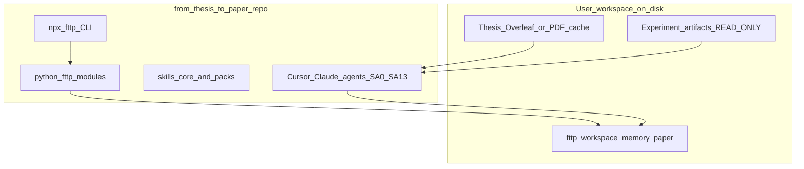
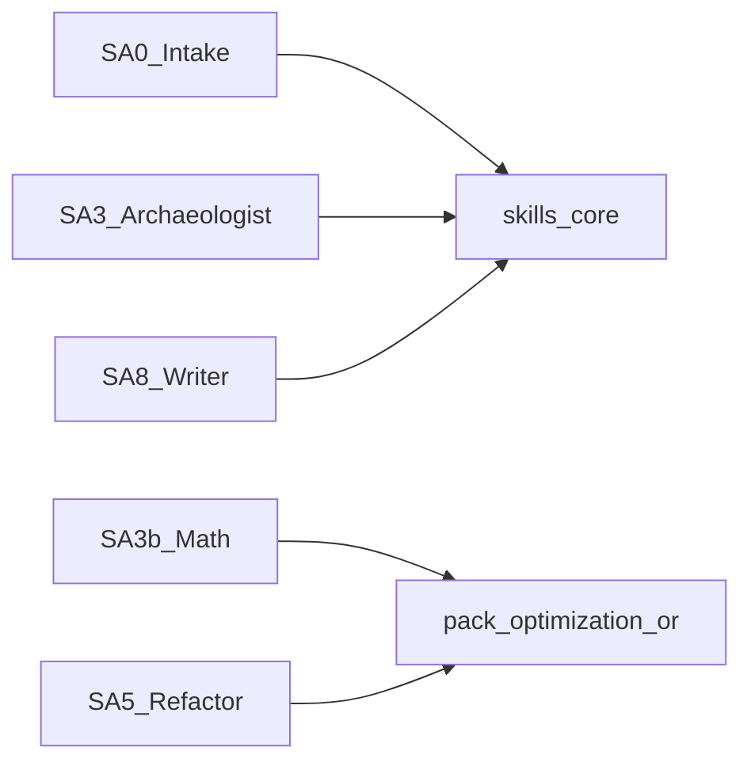
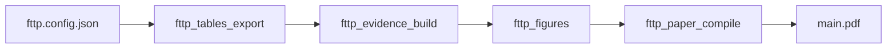
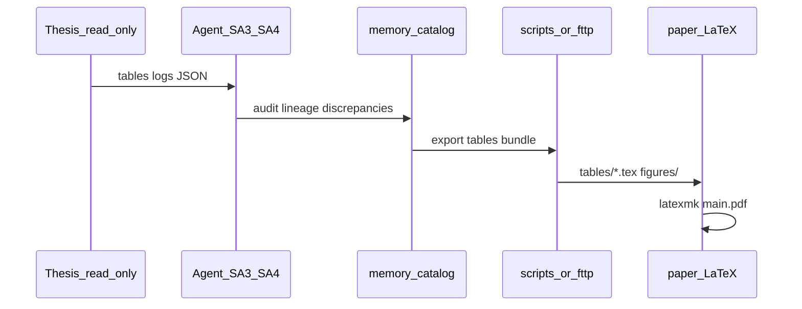

# Architecture — from-thesis-to-paper (fttp)

> System design for the agentified thesis→paper workflow. Diagrams match master plan §3.1–3.3.

---

## 1. Runtime layers (§3.1)

The framework separates **read-only evidence** on disk from a **writable fttp workspace** and the **framework repository** that ships agents, skills, and CLI tooling.



### Layer responsibilities

| Layer | Location | Role |
|-------|----------|------|
| **Thesis archaeology** | `readOnlyRoots`, Overleaf thesis project | Ground truth: equations, tables, narrative; agents read, never overwrite |
| **Golden / user workspace** | `repoRoot` (user project) | Writable `memory/`, `paper/`, `experimentos/`, evidence CSVs |
| **Paper pipeline** | `paper/` + `scripts/` or `python/fttp/` | Tables, figures, LaTeX compile, reproducibility docs |
| **fttp CLI** | `packages/cli` + `python/fttp` | Config-driven orchestration: `doctor`, `tables`, `evidence`, `figures`, `compile`, `pipeline` |

**PaperEPN mapping:** `mi-investigacion-opt` is the active golden workspace; OneDrive `Models comparison_/`, `multigrafo/`, `inst_generation/`, and `Thesis Code/` are read-only archaeology roots (see AGENTS.md).

---

## 2. Agent and skill packs (§3.2)

Subagents SA0–SA13 load **core** skills always; **optimization-or** skills only when the workspace config enables the pack.



| Pack | Path | Requires Gurobi? | Typical agents |
|------|------|------------------|--------------|
| **Core** (12 skills) | `skills/core/` | No | SA0, SA1, SA2, SA2b, SA3, SA4, SA6, SA7, SA8, SA9, SA10, SA12, SA13 |
| **optimization-or** (6 skills) | `skills/packs/optimization-or/` | Optional (`gurobipy`, `gurobi_cl`) | SA3b, SA4o, SA5, SA11 |

Enable pack in config:

```json
"packs": ["optimization-or"]
```

---

## 3. Paper production CLI (§3.3)

Config drives a linear pipeline from evidence to PDF.



**Status in PaperEPN:** CLI and `python/fttp` are **planned** (P6–P7). PaperEPN today uses `scripts/paper/*` and `scripts/archaeology/*` for the same stages. See [`PAPER_PRODUCTION_PIPELINE.md`](PAPER_PRODUCTION_PIPELINE.md).

---

## 4. Configuration — `fttp.config.json`

Loaded from current working directory or path in environment variable `FTTP_CONFIG`.

### 4.1 Schema

| Field | Type | Required | Description |
|-------|------|----------|-------------|
| `workspaceName` | string | yes | Human label for logs and doctor output |
| `repoRoot` | string (absolute path) | yes | Writable project root (memory, paper, experimentos) |
| `readOnlyRoots` | string[] | no | Thesis code, verification trees, instance archives — **never written by agents** |
| `thesis.overleafProjectId` | string | no | 24-char Overleaf id for **read-only** thesis archaeology |
| `thesis.mainTexPath` | string | no | Relative path to key chapter under thesis project |
| `paper.dir` | string | yes | Paper subtree (default `paper`) |
| `paper.mainTex` | string | yes | Entry TeX file (default `main.tex`) |
| `packs` | string[] | no | Enabled skill packs, e.g. `["optimization-or"]` |
| `evidence.catalog` | string | no | Relative path to experiment catalog markdown |
| `evidence.lineageCsv` | string | no | Relative path to log lineage CSV |

### 4.2 Example

```json
{
  "workspaceName": "paperepn-evrp",
  "repoRoot": "/Users/emilio/Desktop/PaperEPN/mi-investigacion-opt",
  "readOnlyRoots": [
    "/Users/emilio/Desktop/PaperEPN/Thesis Code",
    "/Users/emilio/Library/CloudStorage/OneDrive-.../Models comparison_",
    "/Users/emilio/Library/CloudStorage/OneDrive-.../multigrafo"
  ],
  "thesis": {
    "overleafProjectId": "optional-24-hex",
    "mainTexPath": "Capitulos/Resultados.tex"
  },
  "paper": {
    "dir": "paper",
    "mainTex": "main.tex"
  },
  "packs": ["optimization-or"],
  "evidence": {
    "catalog": "memory/thesis_experiment_catalog.md",
    "lineageCsv": "experimentos/evidence/log_lineage.csv"
  }
}
```

User copies `templates/workspace.config.example.json` on first setup (P4). **Do not commit** real `fttp.config.json` if it contains secrets; use `.env` for Overleaf credentials (see `docs/OVERLEAF_MCP_SETUP.md`).

---

## 5. Repository layout

### 5.1 Target: `from-thesis-to-paper` (framework repo)

```
from-thesis-to-paper/
├── docs/              ← EXECUTOR_GUIDE, ARCHITECTURE, pipeline, PORTFOLIO
├── packages/cli/      ← npm bin `fttp`
├── python/fttp/       ← config + commands
├── skills/core/       ← 12 agent skills
├── skills/packs/optimization-or/
├── templates/memory/
├── .cursor/rules/ + .cursor/plans/
└── examples/          ← PaperEPN paths only, no data
```

### 5.2 Reference: PaperEPN (`mi-investigacion-opt`)

| Path | Role | Edit? |
|------|------|-------|
| `mi-investigacion-opt/` | Active golden repo: `codigo/`, `paper/`, `memory/`, `scripts/` | **Yes** |
| `Thesis Code/` | Master notebooks | **READ-ONLY** |
| OneDrive `Models comparison_/` | Cap. 4 verification (~57 GB) | **READ-ONLY** |
| OneDrive `multigrafo/` | Cap. 5 verification | **READ-ONLY** |
| OneDrive `inst_generation/` | GIS instances | **READ-ONLY** |
| OneDrive `Pilot1 …/` | Spatio-temporal EDA pilot | **READ-ONLY** |

The framework repo **does not** submodule PaperEPN or copy verification logs. `examples/paperepn-external.config.json` documents placeholder paths only (P9).

---

## 6. Data flow (evidence → paper)



**Precedence:** thesis tables and signed strategy brief for narrative; code wins on math audit; catalog/log joins for numeric cells; discrepancies only in `REPRODUCIBILITY.md`, not invented in Results body.

---

## 7. Optional integrations

| Integration | Doc | Required? |
|-------------|-----|-----------|
| Overleaf MCP (thesis read-only, paper separate) | `docs/MCP_OVERLEAF_OPTIONAL.md` (P8), PaperEPN `OVERLEAF_MCP_SETUP.md` | No |
| Gurobi CLI / gurobipy | optimization-or pack | Only for MIP workflows |
| Shelby / other MCP | user `.cursor/mcp.json` | No |

**Forbidden:** GurobiMCP; writing to thesis Overleaf from SA12 (paper project only).

---

## 8. Build vs runtime

| Concern | Build (P0–P11) | Runtime (SA0–SA13) |
|---------|----------------|---------------------|
| Who | Executor implementing framework | User + agents on a thesis workspace |
| Plan | `from-thesis-to-paper_master.plan.md` | `from-thesis-to-paper_orchestration.plan.md` |
| Output | Public npm/Python package + skills | `memory/intake_report.md`, `paper/main.pdf`, etc. |

---

## Related docs

- [`EXECUTOR_GUIDE.md`](EXECUTOR_GUIDE.md) — phase index, stop-on-fail, closure protocol
- [`PAPER_PRODUCTION_PIPELINE.md`](PAPER_PRODUCTION_PIPELINE.md) — CLI command matrix
- [`PORTFOLIO.md`](PORTFOLIO.md) — product scope and audience

*Aligned with master plan §3 and §7.*
