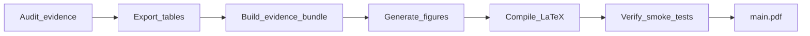

# Paper Production Pipeline

> End-to-end flow from evidence artifacts to journal-ready PDF. Covers **planned** `fttp` CLI (P6–P7) and **current** PaperEPN scripts.

See also: [`EXECUTOR_GUIDE.md`](EXECUTOR_GUIDE.md), [`ARCHITECTURE.md`](ARCHITECTURE.md).

---

## 1. Pipeline overview



| Stage | Purpose | Primary outputs |
|-------|---------|-----------------|
| **Evidence audit** | Join catalog, logs, JSON; flag discrepancies | `memory/*`, lineage CSV, memoria notes |
| **Tables** | LaTeX fragments from catalog/strategy | `paper/tables/*.tex` |
| **Evidence bundle** | Reproducibility manifest | `paper/REPRODUCIBILITY.md`, bundle metadata |
| **Figures** | TikZ/raster per strategy brief | `paper/figures/*` |
| **Compile** | PDF from `main.tex` | `paper/main.pdf` |
| **Verify** | Smoke tests, figure legend, table keys | pytest green |

**Strategy gate:** `memory/paper_strategy_brief.md` (signed narrative, allowed/forbidden claims) must exist before SA8 writing and table export policy.

---

## 2. `fttp` CLI subcommands

**Implementation status:** planned in master plan P6 (Python) + P7 (npm). Not yet present in PaperEPN root; commands below are the **contract** for `npx from-thesis-to-paper`.

| Subcommand | Alias | Description | Depends on config | Planned verify |
|------------|-------|-------------|-------------------|----------------|
| `doctor` | — | Check `fttp.config.json`, paths exist, optional Gurobi hint | `repoRoot`, `readOnlyRoots` | exit 0 |
| `tables` | `tables export` | Export LaTeX table fragments from evidence catalog | `evidence.catalog`, `paper.dir` | files under `paper/tables/` |
| `evidence` | `evidence build` | Build reproducibility bundle / lineage summary | `evidence.*` | bundle paths exist |
| `figures` | — | Generate or refresh figure assets per manifest | `paper.dir` | `paper/figures/` updated |
| `compile` | `paper compile` | Run latexmk (or configured engine) on `paper.mainTex` | `paper.mainTex` | `main.pdf` exists |
| `pipeline` | — | Run `tables` → `evidence` → `figures` → `compile` in order | full config | exit 0, PDF exists |

### 2.1 Invocation (after P7)

```bash
# From workspace root (where fttp.config.json lives)
npx from-thesis-to-paper doctor
npx from-thesis-to-paper tables
npx from-thesis-to-paper evidence
npx from-thesis-to-paper figures
npx from-thesis-to-paper compile
npx from-thesis-to-paper pipeline
```

Environment override:

```bash
export FTTP_CONFIG=/absolute/path/to/fttp.config.json
npx from-thesis-to-paper doctor
```

### 2.2 Failure behavior

If any subcommand fails, the CLI should exit non-zero. Executors must report **`TAREA INCOMPLETA`** and not run downstream stages (e.g. do not `compile` if `tables` failed).

---

## 3. PaperEPN equivalents (today)

Until `fttp` ships, use these scripts from `mi-investigacion-opt` repo root:

| fttp stage | PaperEPN script / action | Notes |
|------------|--------------------------|-------|
| Evidence / lineage | `scripts/archaeology/build_log_lineage.py`, `join_catalog.py`, notebooks under `scripts/archaeology/notebooks/` | Token protection: no full log dumps in chat |
| Tables export | `scripts/paper/export_tables_from_catalog.py` | Honors `paper_strategy_brief` |
| Evidence bundle | `scripts/paper/build_evidence_bundle.py` | |
| Log extraction | `scripts/paper/extract_log_evidence.py` | |
| Figures | `scripts/paper/generate_figures.py` | See `scripts/paper/FIGURE_SOURCES.md` |
| OSM / route figs | `scripts/paper/fetch_osm_graph.py`, `scripts/viz/*` | Optional |
| LaTeX compile | `cd paper && latexmk -pdf main.tex` | |
| Tests | `./scripts/run_tests.sh smoke` | Gurobi smoke, lineage, paper pipeline |

### 3.1 Typical manual sequence (PaperEPN)

```bash
cd /path/to/mi-investigacion-opt

# 1. Tables (after catalog and strategy brief are current)
python scripts/paper/export_tables_from_catalog.py

# 2. Evidence bundle
python scripts/paper/build_evidence_bundle.py

# 3. Figures
python scripts/paper/generate_figures.py

# 4. LaTeX
cd paper && latexmk -pdf main.tex

# 5. Verify
cd .. && ./scripts/run_tests.sh smoke
```

Adjust flags per script `--help`. Archaeology scripts may run earlier in the project lifecycle (Phase 2 in AGENTS.md).

---

## 4. LaTeX structure (PaperEPN reference)

| Path | Role |
|------|------|
| `paper/main.tex` | IMRaD manuscript entry |
| `paper/tables/*.tex` | `\input{}` fragments for Results |
| `paper/figures/` | Graphics and TikZ sources |
| `paper/REPRODUCIBILITY.md` | Tier B discrepancies, recompute policy |
| `paper/JOURNAL_GUIDELINES.md` | Venue constraints (C&OR, etc.) |

Writer agents (SA8) add **one section per pass**; verifier (SA9) runs compile + smoke tests.

---

## 5. Agent pipeline mapping (runtime)

After framework build, orchestration subagents map to pipeline stages:

| Agent | Pipeline contribution |
|-------|-------------------------|
| SA3, SA4 | Evidence audit, catalog joins |
| SA7 | Paper strategy brief |
| SA8 | Prose in `main.tex` |
| SA9 | Figures + LaTeX verify |
| SA12 | Optional Overleaf sync (**paper** project only) |
| SA13 | Submission packaging |

Launch order: see [`from-thesis-to-paper_orchestration.plan.md`](../.cursor/plans/from-thesis-to-paper_orchestration.plan.md) Guía de ejecución.

---

## 6. Quality gates

| Gate | Command / check |
|------|-----------------|
| Config valid | `npx from-thesis-to-paper doctor` (future) or manual JSON parse |
| No invented numbers | Tables trace to catalog or log lineage |
| Smoke tests | `./scripts/run_tests.sh smoke` |
| PDF exists | `test -f paper/main.pdf` |
| Discrepancies | Documented in `REPRODUCIBILITY.md` only, not Results body |

On failure: stop and report **`TAREA INCOMPLETA`** per [`EXECUTOR_GUIDE.md`](EXECUTOR_GUIDE.md).

---

## 7. Configuration keys used by pipeline

From `fttp.config.json` (see [`ARCHITECTURE.md`](ARCHITECTURE.md)):

- `paper.dir`, `paper.mainTex` — compile target
- `evidence.catalog` — table export source
- `evidence.lineageCsv` — log join for Tier A/B evidence
- `readOnlyRoots` — archaeology only; scripts read, never write

---

*CLI contract from master plan P6–P7; PaperEPN scripts as interim implementation.*
