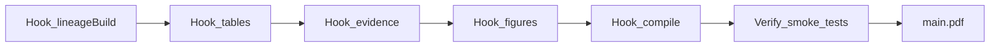

# Paper Production Pipeline

> End-to-end flow from evidence artifacts to journal-ready PDF. **C1:** consumer scripts via `hooks` in `fttp.config.json`. **C2:** reusable checks in `python/fttp/evidence/`.

See also: [`EXECUTOR_GUIDE.md`](EXECUTOR_GUIDE.md), [`ARCHITECTURE.md`](ARCHITECTURE.md), [`TESTING.md`](TESTING.md).

---

## 1. Pipeline overview



| Stage | Purpose | Primary outputs |
|-------|---------|-----------------|
| **Lineage build** | Parse logs / merge JSON fallback (consumer script) | `experimentos/evidence/log_lineage.csv` |
| **Tables** | LaTeX fragments from catalog/strategy | `paper/tables/*.tex` |
| **Evidence bundle** | Reproducibility manifest | `paper/REPRODUCIBILITY.md` |
| **Figures** | TikZ/raster per strategy brief | `paper/figures/*` |
| **Compile** | PDF from active venue `mainTex` | `paper/*.pdf` |
| **Verify** | Framework or consumer smoke tests | pytest green |

**Strategy gate:** signed `memory/paper_strategy_brief.md` in the **consumer workspace** before SA8 writing.

---

## 2. `fttp` CLI subcommands

Install: `pip install -e .` from this repository.

| Subcommand | Description | Config keys |
|------------|-------------|-------------|
| `doctor` | Validate config, `repoRoot`, optional hook paths | `repoRoot`, `hooks`, `paper` |
| `tables` | Run `hooks.tables` under `repoRoot` | `hooks.tables` |
| `evidence` | Run `hooks.evidence` | `hooks.evidence` |
| `figures` | Run `hooks.figures` | `hooks.figures` |
| `compile` | Run venue `build`, else `hooks.compile`, else verify PDF | `paper.activeVenue`, `venueProfiles`, `hooks.compile` |
| `lineage` | `lineage validate --csv …` (C2 library) or `lineage build` → `hooks.lineageBuild` | `hooks.lineageBuild`, `evidence.lineageCsv` |
| `pipeline` | `tables` → `evidence` → `figures` → `compile` (stops on first non-zero exit) | full config |

### 2.1 Invocation

```bash
export FTTP_CONFIG=/path/to/your-workspace/fttp.config.json
python -m fttp doctor
python -m fttp lineage build
python -m fttp tables
python -m fttp evidence
python -m fttp figures
python -m fttp compile
python -m fttp pipeline
```

### 2.2 Failure behavior

Subcommands **propagate** the hook script exit code. No “stub OK” on failure. If a hook is missing, the CLI exits non-zero with a configuration hint.

Optional validation without hooks:

```bash
python -m fttp lineage validate --csv experimentos/evidence/log_lineage.csv
```

Uses `fttp.evidence` (generic CSV columns + Gurobi status helpers) — no OneDrive paths in the framework package.

---

## 3. Hooks contract (C1)

In `fttp.config.json` (paths **relative to `repoRoot`**):

```json
"hooks": {
  "lineageBuild": "scripts/archaeology/build_log_lineage.py",
  "tables": "scripts/paper/export_tables_from_catalog.py",
  "evidence": "scripts/paper/build_evidence_bundle.py",
  "figures": "scripts/paper/generate_figures.py",
  "compile": "scripts/paper/build_primary.sh"
}
```

Illustrative consumer layout: [`examples/paperepn-external.config.json`](../examples/paperepn-external.config.json).

Heavy EVRP scripts stay in the **user workspace**; the framework only delegates via subprocess (`cwd=repoRoot`).

---

## 4. Venue profiles (C3)

User-defined venues (not hardcoded to a single publisher):

```json
"paper": {
  "dir": "paper",
  "mainTex": "main.tex",
  "activeVenue": "primary",
  "venueProfiles": {
    "primary": {
      "id": "user_defined_journal",
      "mainTex": "main_journal.tex",
      "guidelines": "paper/JOURNAL_GUIDELINES.md",
      "build": "scripts/paper/build_primary.sh"
    }
  }
}
```

`fttp compile` uses `venueProfiles[activeVenue].build` when set, else `hooks.compile`, else checks PDF next to `resolve_active_main_tex(cfg)`.

Bring your own document class under `paper/` in the consumer repo — see [`templates/paper/README.md`](../templates/paper/README.md).

---

## 5. Agent pipeline mapping

| Agent | Pipeline contribution |
|-------|-------------------------|
| SA3, SA4 | Evidence audit, catalog joins |
| SA7 | Paper strategy brief |
| SA8 | Prose in `main.tex` (consumer) |
| SA9 | Figures + LaTeX verify |
| SA12 | Optional Overleaf sync (paper project only) |
| SA13 | Submission packaging |

Launch order: [`.cursor/plans/from-thesis-to-paper_orchestration.plan.md`](../.cursor/plans/from-thesis-to-paper_orchestration.plan.md).

---

## 6. Quality gates

| Gate | Command / check |
|------|-----------------|
| Config valid | `python -m fttp doctor` |
| Hooks wired | `hooks.*` paths exist under `repoRoot` (doctor warns) |
| Framework tests | `./scripts/run_tests.sh smoke` in **from-thesis-to-paper** |
| Consumer tests | `./scripts/run_tests.sh smoke` in user workspace |
| No invented numbers | Tables trace to catalog or lineage (SA4) |

On failure: **TAREA INCOMPLETA** per [`EXECUTOR_GUIDE.md`](EXECUTOR_GUIDE.md).

---

*C1 = hooks delegation; C2 = `fttp.evidence` library; consumer scripts remain in the user repository.*
