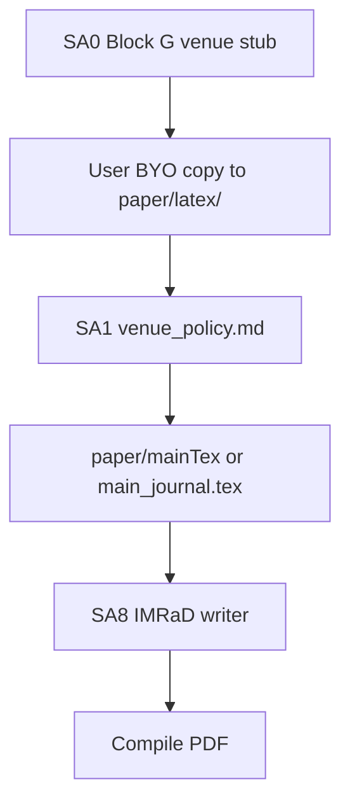

# Venue and LaTeX template onboarding

> **Audience:** SA0 (stub) and SA1 (deep policy).  
> **Language:** English only.

The framework **does not ship** publisher document classes (Elsevier, Springer, IEEE, etc.). You **bring your own** (BYO) template into the paper workspace.

---

## Split of responsibility

| Phase | Agent | Delivers | Mandatory? |
|-------|-------|----------|------------|
| **SA0 Block G** | Intake | Venue id, author guidelines URL, template access mode, paths in config, optional copy into `paper/latex/` | **Yes** — no `TBD` on HANDOFF to SA1 |
| **SA1** | Venue policy | `memory/venue_policy.md`, validated `\documentclass`, updated `paper/JOURNAL_GUIDELINES.md` | **Yes** before SA7/SA8 |
| **SA9 / compile** | Figures + build | Uses `venueProfiles[activeVenue].build` | Requires template on disk |



---

## SA0 — what to collect (stub)

1. **Primary target venue** — journal or conference id + full display name.
2. **Author guidelines URL** — or path to a PDF in a read-only tree.
3. **Template access** (pick one):
   - `local_path` — directory on disk
   - `zip_copy_into_paper_latex` — user provides archive
   - `download_url` — user confirms license to download
   - `overleaf_template_project_id` — read-only copy from a template Overleaf project into the paper repo
4. **Backup venue** (optional) → `paper.venueProfiles.alternate`.
5. **Confirm BYO** — framework repo will not add `.cls` / `.bst` files; user has the right to copy the template.

Record in:

- `memory/intake_report.md` (venue section)
- `memory/venue_template_manifest.md` (files installed, source path, license note)

Config shape (see [ARCHITECTURE.md](ARCHITECTURE.md)):

```json
"paper": {
  "activeVenue": "primary",
  "venueProfiles": {
    "primary": {
      "id": "journal_slug",
      "displayName": "Journal full name",
      "authorGuidelinesUrl": "https://...",
      "mainTex": "main_journal.tex",
      "templateSource": "local_path",
      "templatePath": "paper/latex/vendor/",
      "templateDeferred": false,
      "build": "scripts/paper/build_primary.sh"
    }
  }
}
```

---

## SA1 — deep policy

SA1 expands the stub into actionable rules:

| Output | Purpose |
|--------|---------|
| `memory/venue_policy.md` | Page limits, section order, reference style, data/code policy, APC if relevant |
| `paper/JOURNAL_GUIDELINES.md` | Checklist pointer + venue URL |
| Template verification | `\documentclass` in `mainTex` matches files under `templatePath` |
| `doctor` warnings | Empty `paper/latex/` when `activeVenue` set and no `templateDeferred` |

**Blocked:** SA7 and SA8 if `venue_policy.md` is missing or template files are absent — unless the user signed `templateDeferred` with a target date (max recommended deferral: 7 days; SA8 still blocked until SA1 completes).

**WHY (SA1, one paragraph for the user):** We now extract detailed rules from the author guide and verify that the document class matches the files you copied, so later prose and figures fit the journal shell.

Gate: **G1-venue** — [USER_APPROVAL_GATES.md](USER_APPROVAL_GATES.md).

---

## Where files live (writable paper repo only)

| Path | Contents |
|------|----------|
| `paper/latex/<vendor>/` | User-copied `.cls`, `.bst`, logos (if allowed) |
| `paper/main.tex` | Minimal stub until venue `mainTex` is chosen |
| `paper/<main_journal.tex>` | Entry file when venue requires a different root |
| `paper/JOURNAL_GUIDELINES.md` | Human checklist; limits filled after SA1 |

**Forbidden:**

- Committing publisher templates to **REPO_FTTP** (`from-thesis-to-paper`).
- Editing the **thesis** Overleaf project to install the journal class.
- Assuming default Elsevier/Springer files without a user-provided source.

---

## License caution

In `venue_template_manifest.md`, note:

- Source URL or path
- Whether redistribution in a public Git repo is allowed
- Files actually copied (hash or list)

The framework does not audit legal compliance; the user confirms copy rights during SA0 Block G.

---

## Undecided venue

If the venue is not final:

- Set `templateDeferred: true` with a date in `intake_report.md`.
- SA1 can still run on a **provisional** template (preprint, `article` class).
- **SA8 remains blocked** until G1-venue is approved with the final template.

---

## Related docs

| Doc | Contents |
|-----|----------|
| [ONBOARDING_RATIONALE.md](ONBOARDING_RATIONALE.md) | Block G WHY/ASK/YOU_DO |
| [ONBOARDING.md](ONBOARDING.md) | End-user steps |
| [ARCHITECTURE.md](ARCHITECTURE.md) | `venueProfiles` schema |
| [PAPER_PRODUCTION_PIPELINE.md](PAPER_PRODUCTION_PIPELINE.md) | Compile commands |
