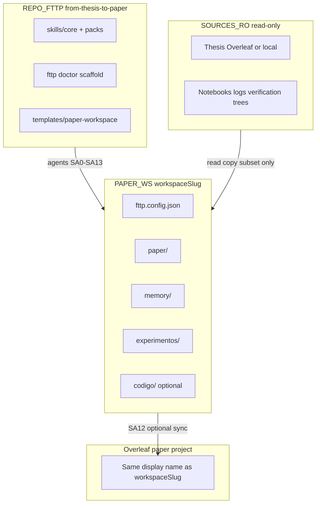
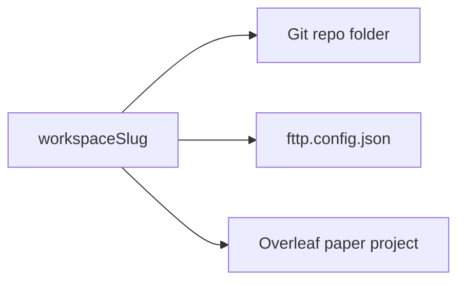

# Workspace model — three repositories

> **Audience:** end users and agents during SA0 onboarding.  
> **Language:** English only (canonical product doc).

The **from-thesis-to-paper** (`fttp`) framework never stores your thesis, verification trees, or journal manuscript inside the framework repository. You work across **three logical repositories** (they may live on the same machine but must stay **separate** on disk and in Git).

---

## 1. The three layers

| Layer | Symbol | Writable? | Typical location |
|-------|--------|-----------|------------------|
| **Framework** | `REPO_FTTP` | No (for your thesis data) | Clone of `from-thesis-to-paper` |
| **Read-only ground truth** | `SOURCES_RO` | **Never** | Thesis Overleaf, notebooks, logs, cloud mounts |
| **Paper workspace** | `PAPER_WS` | **Yes** | New Git repo you create for one article |



### Framework (`REPO_FTTP`)

- Ships skills, orchestration prompts, `python/fttp`, and `templates/paper-workspace/`.
- **Does not** contain your thesis PDF, 57GB verification folders, or publisher `.cls` files.
- You install it once; many paper workspaces can point at the same clone.

### Read-only ground truth (`SOURCES_RO`)

- Thesis narrative, equations, tables, master notebooks, batch logs, GIS archives.
- Listed in `fttp.config.json` → `readOnlyRoots` and/or `thesis.overleafProjectId`.
- Agents **read** and may **copy a bounded subset** into the paper workspace (see [Copy manifest](#4-copy-manifest)); they **never** edit these paths.

### Paper workspace (`PAPER_WS`)

- A **new** directory and Git repository for **one** journal or conference submission.
- Contains `memory/`, `paper/`, `experimentos/`, optional `codigo/`, and `fttp.config.json`.
- This is the only tree agents should write during the paper pipeline (unless you explicitly enable refactor under `codigo/`).

---

## 2. Slug rule — one name, three places

Use a single identifier `workspaceSlug` everywhere it matters:

| Place | Must match `workspaceSlug`? |
|-------|----------------------------|
| Folder / Git repository name | **Yes** (recommended) |
| `fttp.config.json` → `workspaceSlug` or `workspaceName` | **Yes** (config field; see [ARCHITECTURE.md](ARCHITECTURE.md)) |
| Overleaf **paper** project display name | **Yes** (user creates empty project) |
| Overleaf **thesis** project | **No** — different project, read-only |



**Why:** One name reduces sync mistakes (SA12 push/pull, CI paths, handoff between collaborators).

**Format (planned validator):** `^[a-z0-9][a-z0-9_-]{2,63}$` — lowercase, hyphens/underscores, 3–64 chars.

**Examples:** `evrp-sssmp-journal-2026`, `terrain-vrp-2025`.

**Not the slug:** thesis folder name, OneDrive mount label, or framework repo name.

---

## 3. What agents never write

| Target | Rule |
|--------|------|
| `readOnlyRoots[]` | No create/update/delete |
| Thesis Overleaf project | Read-only archaeology only |
| Framework repo `from-thesis-to-paper` | No user thesis data commits |
| Publisher templates in framework | **Forbidden** — BYO into `paper/latex/` only |
| Full verification trees | Do not copy multi-GB trees wholesale; use manifest + `copyPolicy` |

Violations are **TAREA INCOMPLETA** for the agent step and must be reported to the user.

---

## 4. Copy manifest

Evidence and tables enter the paper workspace through a **controlled copy**, not by making read-only trees writable.

| Source (RO) | Typical destination (writable) | Policy |
|-------------|----------------------------------|--------|
| Excel/CSV summaries | `experimentos/evidence/` | Prefer summaries over raw logs |
| Catalog rows | `memory/thesis_experiment_catalog.md` | Agent-maintained; TBD/DISCREPANCY tags |
| Selected `.log` tails | `experimentos/evidence/` | Token-safe excerpts only |
| Thesis table fragments | `paper/tables/*.tex` | After SA4 triangulation |
| Venue template files | `paper/latex/<vendor>/` | User-supplied BYO; see [VENUE_TEMPLATE_ONBOARDING.md](VENUE_TEMPLATE_ONBOARDING.md) |

**`copyPolicy` (config, planned):**

```json
"copyPolicy": {
  "maxArtifactMb": 500,
  "allowSymlinks": false
}
```

- **`maxArtifactMb`:** refuse or warn when a single copy would exceed the limit.
- **`allowSymlinks`:** default `false` so clones work on Windows and CI without broken links.

Record what was copied in `memory/intake_report.md` (SA0) and evidence skills (SA3–SA4); discrepancies go to `memory/discrepancy_registry.md`.

---

## 5. Overleaf: two projects

| Project | Role | Agent access |
|---------|------|--------------|
| **Thesis** | Ground truth narrative/tables | Read-only (MCP optional) |
| **Paper** | Journal manuscript | Read/write **only** `paper/` subtree via SA12 |

Credentials live in gitignored `.env` — never in `memory/` or commits.

Setup: [MCP_OVERLEAF_OPTIONAL.md](MCP_OVERLEAF_OPTIONAL.md), [OVERLEAF_MCP_SETUP.md](OVERLEAF_MCP_SETUP.md).

---

## 6. Workflow and writing modes (overview)

Configured in `fttp.config.json` (see [ARCHITECTURE.md](ARCHITECTURE.md) §4):

| Field | Purpose |
|-------|---------|
| `workflowProfile` | How many pipeline stages you run (`paper_only` … `full_pipeline`) |
| `writingMode` | How prose is produced (`thesis_adapt`, `compose`, `hybrid`) |
| `overleafPaper` | Paper Overleaf `projectId` + display name |
| `copyPolicy` | Size/symlink limits for evidence copy |

Approval checkpoints depend on `workflowProfile` — see [USER_APPROVAL_GATES.md](USER_APPROVAL_GATES.md).

---

## 7. Scaffold vs legacy workspace

| Approach | When |
|----------|------|
| **Recommended** | `fttp scaffold --slug NAME` or SA0 copies `templates/paper-workspace/` into a **new** folder |
| **Legacy** | Existing monorepo (e.g. PaperEPN `mi-investigacion-opt`) — document paths in config; still treat RO roots as read-only |

Optional example: [WORKSPACE_EXAMPLE_PAPEREPN.md](WORKSPACE_EXAMPLE_PAPEREPN.md).

---

## Related docs

| Doc | Contents |
|-----|----------|
| [ONBOARDING.md](ONBOARDING.md) | Install → SA0 → doctor → RUN |
| [ONBOARDING_RATIONALE.md](ONBOARDING_RATIONALE.md) | WHY-before-ASK per SA0 block |
| [USER_APPROVAL_GATES.md](USER_APPROVAL_GATES.md) | G0–G13 approval gates |
| [ARCHITECTURE.md](ARCHITECTURE.md) | Config schema, runtime layers |
| [VENUE_TEMPLATE_ONBOARDING.md](VENUE_TEMPLATE_ONBOARDING.md) | BYO LaTeX template |
