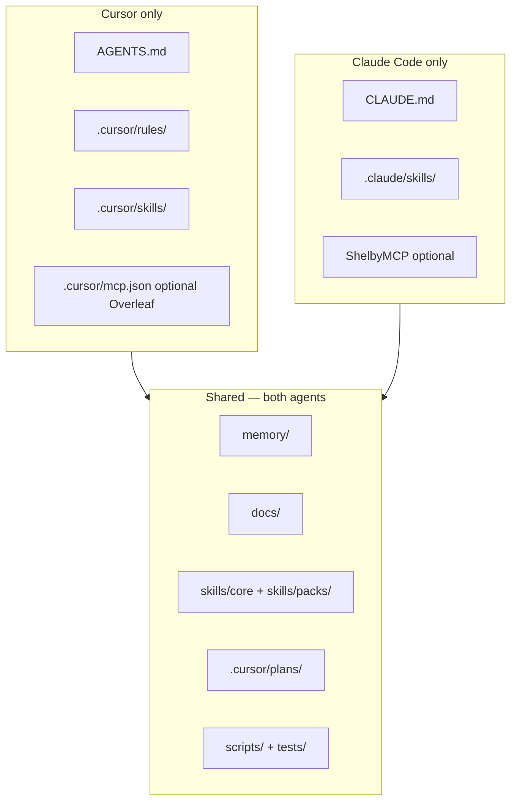

# Sync checklist — Cursor ↔ Claude Code

> **Canonical (P10):** this file. **Extended PaperEPN log:** [`memory/sync_cursor_claude.md`](../memory/sync_cursor_claude.md) (parity gaps, paper v2 snapshot).

Use when you change **entry files**, workflow guardrails, skill packs, orchestration, or workspace map.

---

## Architecture



| Layer | Cursor | Claude | Must match? |
|-------|--------|--------|-------------|
| Entry file | `AGENTS.md` | `CLAUDE.md` | **Yes** (policy, not byte-identical) |
| Cross-load | **Never** `CLAUDE.md` / `.claude/**` as entry | **Never** `AGENTS.md` / `.cursor/skills/**` as entry | **Yes** |
| Phases 1–5 / guardrails | `AGENTS.md` + rules | `CLAUDE.md` | **Yes** |
| fttp executor index | `docs/EXECUTOR_GUIDE.md` | same | **Yes** |
| Skill packs | `docs/PACKS.md` + config `packs[]` | same | **Yes** |
| Orchestration topology | `.cursor/rules/plan-and-subagent-orchestration.mdc` | read same rule path | **Yes** |
| Runtime SA prompts | `.cursor/plans/from-thesis-to-paper_orchestration.plan.md` | same path | **Yes** |
| Gurobi `gurobi_cl` | both entry files | both entry files | **Yes** |
| Overleaf | `.cursor/mcp.json` optional | `npx overleaf-mcp` — **no** `.cursor/mcp.json` required | Documented both |
| Shelby | — | optional `.claude/settings.local.json` | Claude-only OK |
| Domain skills | `.cursor/skills/` | `.claude/skills/` | Same intent when mirrored |

---

## When to run this checklist

- Edited `AGENTS.md` or `CLAUDE.md`
- Added/changed `packs` in `workspace.config.json` / `fttp.config.json`
- Changed `.cursor/rules/plan-and-subagent-orchestration.mdc` or orchestration plans
- Added core or pack skills under `skills/`
- Changed Overleaf / Shelby / Gurobi policy

---

## Checklist (tick both stacks)

### 1 — Entry boundary

- [ ] `AGENTS.md` states: Cursor must **not** cross-load `CLAUDE.md`
- [ ] `CLAUDE.md` states: Claude must **not** cross-load `AGENTS.md`
- [ ] Both link this file and `docs/EXECUTOR_GUIDE.md`

### 2 — fttp framework pointers

- [ ] Both list `docs/PACKS.md` and `optimization-or` when relevant
- [ ] Both reference `from-thesis-to-paper_master.plan.md` and `from-thesis-to-paper_orchestration.plan.md`
- [ ] `examples/README.md` unchanged or cross-checked if config schema moved

### 3 — Workspace map

- [ ] Six-folder table identical in `AGENTS.md` and `CLAUDE.md`
- [ ] READ-ONLY roots named the same way
- [ ] No invented paths in entry files (detail → `memory/workspace_inventory.md`)

### 4 — Phases and guardrails

- [ ] Phases 1–5 (or SA pipeline) aligned
- [ ] Token protection, max-3-steps, read-only rule — same intent
- [ ] `./scripts/run_tests.sh smoke` documented in both

### 5 — On-demand memory list

Both entry files must cite the same `memory/` files:

- [ ] `thesis_scientific_structure.md`
- [ ] `thesis_model_registry.md`
- [ ] `thesis_experiment_catalog.md`
- [ ] `thesis_ab_cross_review.md`
- [ ] `paper_strategy_brief.md`
- [ ] `agent_stack.md`
- [ ] `thesis_experiment_run_artifacts.md` (PaperEPN)
- [ ] `thesis_to_golden_archaeology.plan.md` path under `.cursor/plans/`

### 6 — Skill packs

- [ ] `docs/PACKS.md` lists `optimization-or` skills
- [ ] Entry files say core runs without Gurobi
- [ ] Cursor `.cursor/skills/packs/optimization-or/` mirrors canonical pack (if pack enabled in reference config)

### 7 — Gurobi

- [ ] `gurobi_cl modelo.lp` in both entry files
- [ ] **NO** GurobiMCP documented as forbidden

### 8 — Overleaf

- [ ] Cursor: `.cursor/mcp.json` + `docs/OVERLEAF_MCP_SETUP.md` (optional)
- [ ] Claude: `npx overleaf-mcp` / terminal — **not** requiring `.cursor/mcp.json`
- [ ] Thesis read-only; local `paper/` canonical for submission

### 9 — Shelby (Claude only)

- [ ] Documented as optional in `CLAUDE.md` and `memory/agent_stack.md`
- [ ] Not required in `AGENTS.md`

### 10 — Translation (on demand)

- [ ] Both point to `.cursor/rules/translation.mdc` + `docs/TRANSLATION_GUIDE.md`
- [ ] Default infra targets include `docs/sync_cursor_claude.md`
- [ ] `paper/main.tex` excluded unless user explicitly asks

---

## Quick reference

| What changed | Update Cursor | Update Claude | Shared doc |
|--------------|---------------|---------------|------------|
| Entry policy | `AGENTS.md` | `CLAUDE.md` | this file |
| Packs | `AGENTS.md` § packs | `CLAUDE.md` § packs | `docs/PACKS.md` |
| Orchestration | rule + plans table | same paths in `CLAUDE.md` | `EXECUTOR_GUIDE.md` |
| New core skill | `.cursor/skills/` | `.claude/skills/` | `skills/core/*.md` |
| New pack skill | `.cursor/skills/packs/` | mirror if used | `skills/packs/` |
| Parity gap log | — | — | `memory/sync_cursor_claude.md` |

---

## Smoke test

```bash
cd mi-investigacion-opt && ./scripts/run_tests.sh smoke
```

**Cursor:** New chat → cites `AGENTS.md`, six folders, does not treat `CLAUDE.md` as entry.  
**Claude:** New session → loads `CLAUDE.md`, same shared playbook path, does not treat `AGENTS.md` as entry.

---

## Last synced

| Date | Change | By |
|------|--------|-----|
| 2026-05-24 | P10: entry boundary, packs, EXECUTOR_GUIDE, fttp plans; `docs/sync` canonical | B11 |

_Update this table when you complete a sync._
