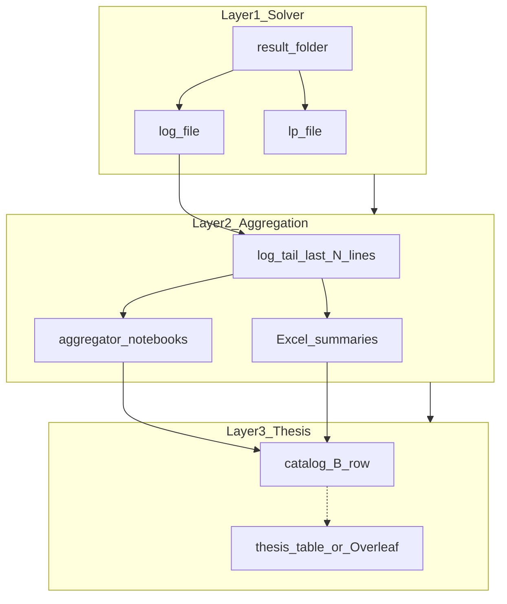

# Evidence and source precedence — fttp workflow

> **Template:** agents follow these rules when joining catalog rows, logs, Excel aggregators, and thesis tables.  
> **Do not invent numbers:** use `TBD` or `DISCREPANCY` per workspace non-negotiables.

## Evidence chain (three layers)

---

## Source types and what each proves

| Source | What it proves | Typical use |
|--------|----------------|-------------|
| **Solver `.log` tail** | Gurobi (or solver) objective on **that** run folder | Technical reproducibility; golden join |
| **Excel / aggregator notebook** | Which runs entered a published table (filters, batch) | Operational lineage |
| **Catalog B row** | Value printed or imported for thesis tables | Publication anchor |
| **Master notebook / `codigo/`** | Formulation and parameters (code wins in math audit) | Models section; not numeric table default |
| **Thesis PDF / Overleaf** | Narrative and table archaeology | Read-only; do not dump full PDF in chat |
| **LOCKED fixture** | User-approved golden case after triangulation | Integration tests; one-row repro |

---

## Precedence by task (mandatory)

| Task | Primary source | Secondary | Never alone |
|------|------------------|-----------|-------------|
| Golden / join audit (SA4) | Log tail + catalog B | Excel if listed in manifest | Folder name as objective |
| Paper Results table cell | Per **signed** `evidence_path` in strategy brief | Catalog or export | Unverified log pick |
| Math formulation (SA3b) | Code / master notebook | Thesis equation | Thesis when code disagrees |
| Narrative claims (SA8) | Signed brief + tables in `paper/` | Thesis mirror prose | Invented gaps or runtimes |
| Discrepancy documentation | `memory/evidence_discrepancies.md` or `paper/REPRODUCIBILITY.md` | — | Silent favoritism |

### `evidence_path` policies (SA7)

| Policy | Table numbers from | Recompute |
|--------|-------------------|-----------|
| `thesis_tables_only` | Catalog B / thesis-mirror export | No batch Gurobi in v1 |
| `hybrid_B_plus` | B rows + locked golden + selective log confirm | Named rows only |
| `recompute_A` | Re-solve approved instances | Requires Gurobi + user OK |

---

## Lineage status labels (join output)

| Status | Condition |
|--------|-----------|
| `CONFIRMED` | B ≈ log ≈ Excel within tolerance |
| `LOG_ONLY` | B ≈ log; no Excel |
| `EXCEL_ONLY` | B ≈ Excel; log missing |
| `DISCREPANCY` | Any pair diverges — document, do not pick favorable value |
| `NOT_FOUND` | No folder/log for catalog row |
| `TBD` | Evidence not yet located |

**Tolerance (default):** relative 1e-2 or absolute 0.01 unless brief specifies otherwise.

---

## READ-ONLY roots (never write)

| Root role | Example path placeholder |
|-----------|--------------------------|
| Master thesis notebooks | `/path/to/Thesis Code` |
| Verification results | `/path/to/Models comparison_` |
| Instance / multigraph archives | `/path/to/multigrafo`, `/path/to/inst_generation` |
| Thesis Overleaf project | MCP read-only archaeology |

Writable defaults: `memory/`, `paper/`, `experimentos/`, `codigo/` (only when SA5/SA11 ports code).

---

## Token protection

- Prefer Excel/CSV summaries and catalog excerpts over multi-GB `.log` dumps.
- Use archaeology scripts + manifests (`verification_index`, `aggregation_manifest`) before raw tree listing.
- Mark offline OneDrive roots `status=OFFLINE` and stop C2/C1 steps that require them.
