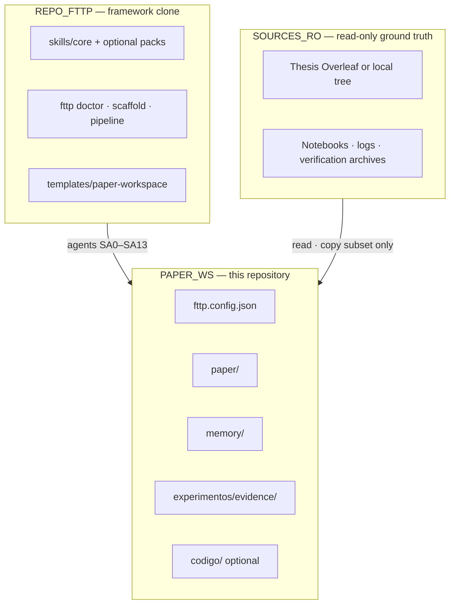
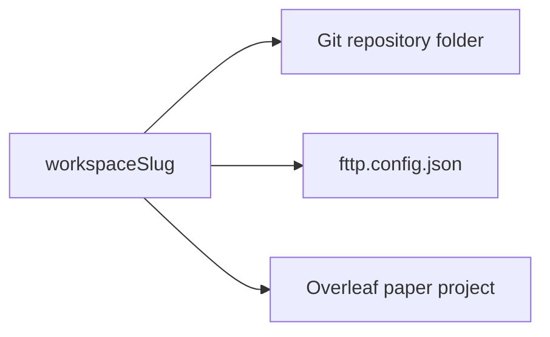
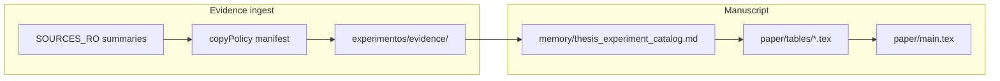

# Paper workspace — `{{WORKSPACE_SLUG}}`

> **Consumer scaffold** from [from-thesis-to-paper](https://github.com/your-org/from-thesis-to-paper).  
> Copy this tree into a **new** Git repository for one journal or conference submission. Replace `{{WORKSPACE_SLUG}}` everywhere during SA0 onboarding.

## Why this repository exists

Your thesis, verification trees, and master notebooks stay **read-only** on disk or in a separate Overleaf project. This repo is the **only writable home** for the journal manuscript, agent memory, and a bounded evidence subset.

The **from-thesis-to-paper** (`fttp`) framework (skills, CLI, tests) lives in a **different** clone — it never stores your thesis data or publisher `.cls` files.



## One slug, three places

Use the same identifier `{{WORKSPACE_SLUG}}` for the Git folder name, `fttp.config.json` → `workspaceSlug`, and the **Overleaf paper** project display name (not the thesis project).



| Place | Writable? | Agent rule |
|-------|-----------|------------|
| `readOnlyRoots[]` in config | **No** | Read and bounded copy only |
| Thesis Overleaf project | **No** | Archaeology only (optional MCP) |
| This repo (`paper/`, `memory/`, `experimentos/`) | **Yes** | Default write target |
| Framework repo `from-thesis-to-paper` | **No user data** | Do not commit thesis or logs there |

## Layout

| Path | Role |
|------|------|
| `fttp.config.json` | Workspace contract: slug, RO roots, venue, hooks |
| `.env` | Gitignored secrets (Overleaf, optional Gurobi) — copy from `.env.example` |
| `memory/` | Catalog, strategy brief, intake report, discrepancy registry |
| `paper/main.tex` | Manuscript entry (may change after SA0/SA1 venue setup) |
| `paper/JOURNAL_GUIDELINES.md` | Venue checklist stub → filled in SA1 |
| `paper/latex/` | **BYO** publisher class files (not shipped by fttp) |
| `paper/REPRODUCIBILITY.md` | Tier A/B replication and external path policy |
| `experimentos/evidence/` | Summaries, lineage CSV, bounded log excerpts |
| `scripts/run_tests.sh` | Smoke gate before handoff to LaTeX writers |



## Reproducibility

- **Tier A:** Locked golden anchors, fixture JSON, and integration tests under your workspace (see [`paper/REPRODUCIBILITY.md`](paper/REPRODUCIBILITY.md)).
- **Tier B:** Full historical verification trees stay **outside** this repo; cite paths in `REPRODUCIBILITY.md` and `memory/intake_report.md` without copying multi-GB trees wholesale.
- **Numbers:** Use `TBD` until catalog or approved export; use `DISCREPANCY` when log vs catalog vs thesis disagree — never silently pick the favorable value.

Run the smoke gate after config or `codigo/` changes:

```bash
./scripts/run_tests.sh smoke
```

## Quick start

1. Copy this folder to `~/projects/{{WORKSPACE_SLUG}}` and `git init`.
2. Replace `{{WORKSPACE_SLUG}}` in `fttp.config.json`, this README title, and create an empty **Overleaf paper** project with the same display name.
3. Copy `.env.example` → `.env` (never commit `.env`).
4. Set `readOnlyRoots[]` to thesis notebooks, verification data, etc.
5. Run SA0 (`agent-intake`) → `python -m fttp doctor` from the framework clone.

## Related documentation (framework repo)

| Doc | Topic |
|-----|--------|
| [WORKSPACE_MODEL.md](../../docs/WORKSPACE_MODEL.md) | Three-repo model, copy manifest |
| [ONBOARDING.md](../../docs/ONBOARDING.md) | Install → SA0 → doctor |
| [VENUE_TEMPLATE_ONBOARDING.md](../../docs/VENUE_TEMPLATE_ONBOARDING.md) | BYO LaTeX template |
| [OVERLEAF_MCP_SETUP.md](../../docs/OVERLEAF_MCP_SETUP.md) | Optional Overleaf MCP |
